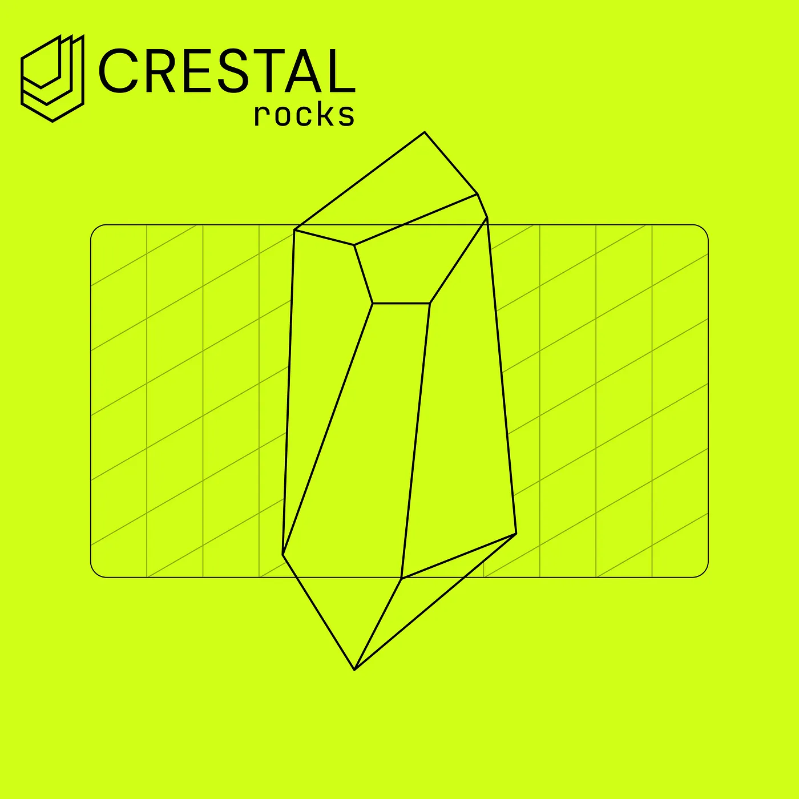
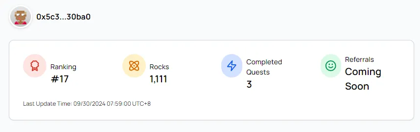
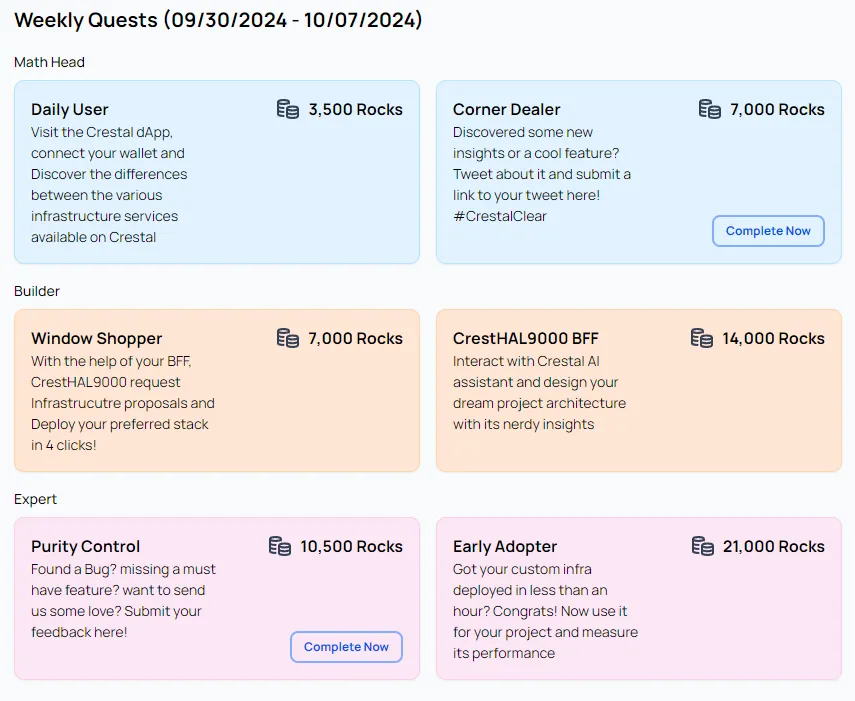

We’re excited to launch Crestal Carbon’s Testnet Incentives Program, where your participation shapes the future of our platform and rewards you with Crestal Rocks. Whether you’re a developer, tester, or Web3 enthusiast, this is your chance to get involved, earn exclusive rewards, and secure a spot on the leaderboard!

## How the Program Works

The program is simple: complete quests, track your progress, invite friends, and collect Crestal Rocks to climb the leaderboard. Top contributors can unlock special recognition, bragging rights, and even future perks within the Crestal ecosystem. With weekly quests and new challenges, there’s always a way to get involved and make your mark!

## Getting Started: Setting Up Your Profile

To kick things off, make sure you’ve connected your wallet to our Testnet App. This will give you access to our newly launched Profile Page, where you can:

- **View your current rank** on the leaderboard.
- **Track the number of Rocks** you’ve collected so far.
- **See how many quests you’ve completed** and what’s still available.
- **Check your referral codes** and referral boosters (coming soon!).

<Info>
  Crestal testnet quests can be completed on either Berachain testnet (Bartio) or Polygon testnet (Amoy). You will need test gas tokens for each option.
  - **Polygon Amoy faucet**: [Option 1](#), [Option 2](#), [Option 3](#)
  - **Berachain Bartio faucet**: [Option 1](#), [Option 2](#)
</Info>

## Completing Quests: Step-by-Step Instructions

Each quest in the Crestal Carbon testnet is designed to engage you with our platform, explore our capabilities, and help us gather crucial feedback. As our platform evolves, new quests may be released and covered in future articles.
This quests list is valid as of Oct 1, 2024.

#### 1. Daily User
**Description**: Explore the Crestal Carbon testnet app, connect your wallet, and dive into the dApps modules.

<Steps>
  <Step>
    Go to [https://app.testnet.crestal.xyz/](https://app.testnet.crestal.xyz/).
  </Step>
  <Step>
    Connect your wallet to the testnet.
  </Step>
  <Step>
    Navigate through the app and explore different modules at least once a day for a week.
  </Step>
</Steps>

<Info>**Repeatable**: Each connection and navigation counts as 1 completion. The more completions, the larger the share of the Rocks distributed at the end of the week. </Info>

  <iframe
    width="800"
    height="450"
    src="https://www.youtube.com/embed/e05Wg13NFLw?si=BDqUFL1rRgv-A7SO"
    title="YouTube video player"
    frameborder="0"
    allow="accelerometer; autoplay; clipboard-write; encrypted-media; gyroscope; picture-in-picture; web-share"
    referrerpolicy="strict-origin-when-cross-origin"
    allowfullscreen
  ></iframe>

#### 2. Corner Dealer
**Description**: Create interesting X posts about Crestal and link your wallet to earn Rocks.

<Steps>
  <Step>
    Compose a tweet about your experience or learnings with Crestal Carbon using #CrestalClear, #CrestalMath, or #CrestalCarbon.
  </Step>
  <Step>
    Ensure your tweet highlights a unique insight, feature, or suggestion.
  </Step>
  <Step>
    Complete the quest by submitting the form with your tweet information.
  </Step>
</Steps>

<Info>**Repeatable**: Each unique, original post counts as 1 completion.</Info>

  <iframe
    width="800"
    height="450"
    src="https://www.youtube.com/embed/TtxxtQRe9q0?si=GXTZ_6fXH4b_88BK"
    title="YouTube video player"
    frameborder="0"
    allow="accelerometer; autoplay; clipboard-write; encrypted-media; gyroscope; picture-in-picture; web-share"
    referrerpolicy="strict-origin-when-cross-origin"
    allowfullscreen
  ></iframe>

#### 3. CrestHAL9000 BFF
**Description**: Collaborate with the Crestal AI9000 to design a project architecture and submit it to the marketplace.

<Steps>
  <Step>
    Click “New Project” to start designing.
  </Step>
  <Step>
    Chat with CrestHAL9000 to design a project architecture.
  </Step>
  <Step>
    Submit the design to the Crestal marketplace for custom deployment proposals.
  </Step>
</Steps>

<Info>**Repeatable**: Each unique proposal request counts as 1 completion.</Info>

  <iframe
    width="800"
    height="450"
    src="https://www.youtube.com/embed/PaoZapwFLsY?si=TTaUEJRmug8eaOkp"
    title="YouTube video player"
    frameborder="0"
    allow="accelerometer; autoplay; clipboard-write; encrypted-media; gyroscope; picture-in-picture; web-share"
    referrerpolicy="strict-origin-when-cross-origin"
    allowfullscreen
  ></iframe>

#### 4. Window Shopper
**Description**: Receive proposals on the Crestal marketplace, select one, and deploy it.

<Steps>
  <Step>
    Submit a request for proposals to the marketplace.
  </Step>
  <Step>
    Browse the received proposals.
  </Step>
  <Step>
    Select and approve a proposal for deployment.
  </Step>
</Steps>

<Info>**Repeatable**: Each deployment counts as 1 completion.</Info>

  <iframe
    width="800"
    height="450"
    src="https://www.youtube.com/embed/erZ2rPFZHf8?si=DyLQmIsWQj0LRy52"
    title="YouTube video player"
    frameborder="0"
    allow="accelerometer; autoplay; clipboard-write; encrypted-media; gyroscope; picture-in-picture; web-share"
    referrerpolicy="strict-origin-when-cross-origin"
    allowfullscreen
  ></iframe>

#### 5. Purity Control
**Description**: Test new features, provide feedback, and report any bugs.

<Steps>
  <Step>
    Explore recently released features in the Crestal Carbon testnet.
  </Step>
  <Step>
    Write a short report on what you liked, improvements, and issues.
  </Step>
  <Step>
    Complete the quest by submitting the feedback form.
  </Step>
</Steps>

<Info>**Repeatable**: Each helpful feedback submission counts as 1 completion.</Info>

  <iframe
    width="800"
    height="450"
    src="https://www.youtube.com/embed/VGxNwTKqEuc?si=lI1HHKMkyI2rCWBs"
    title="YouTube video player"
    frameborder="0"
    allow="accelerometer; autoplay; clipboard-write; encrypted-media; gyroscope; picture-in-picture; web-share"
    referrerpolicy="strict-origin-when-cross-origin"
    allowfullscreen
  ></iframe>

#### 6. Early Adopter
**Description**: Use deployed infra Legos in your projects to complete this quest.

<Steps>
  <Step>
    Deploy an infra module using Crestal.
  </Step>
  <Step>
    Integrate the module into your project.
  </Step>
  <Step>
    Use the Crestal module regularly in your project.
  </Step>
</Steps>

<Info>**Repeatable**: Each read/write request sent to the infra module counts as 1 completion.</Info>

  <iframe
    width="800"
    height="450"
    src="https://www.youtube.com/embed/qUWnBPu6vx8?si=dM-17ONAv8Ym6Kna"
    title="YouTube video player"
    frameborder="0"
    allow="accelerometer; autoplay; clipboard-write; encrypted-media; gyroscope; picture-in-picture; web-share"
    referrerpolicy="strict-origin-when-cross-origin"
    allowfullscreen
  ></iframe>

## How Rocks Are Distributed

At the end of each week (Monday 00:00:00 UTC), we calculate the number of quests completed by each user, divide it by the total completions for each quest, and apply the ratio to the Rocks bag allocated to that quest.

<Info>
  **Example**

  During the week, 3 users complete the Corner Dealer quest.

  The quest has a bag of 7,000 Rocks to be distributed at the end of the week.

  **User Completions**:
  - User 1: completed the Corner Dealer quest 4 times
  - User 2: completed the Corner Dealer quest 2 times
  - User 3: completed the Corner Dealer quest 1 time

  **Total Completions**: 7

  **Rock Distribution**:
  - User 1: 7000 × (4/7) = 4000 Rocks
  - User 2: 7000 × (2/7) = 2000 Rocks
  - User 3: 7000 × (1/7) = 1000 Rocks
</Info>

## Tracking Your Progress

The Profile Page includes two key sections to keep track of your achievements:

- **Leaderboard Tab**: See how you stack up against other users and challenge yourself to climb higher.
- **History Tab**: View a detailed log of each week you participated in and the corresponding Rocks earned.

Use these tools to strategize and set new goals each week!

## Referral Program Coming Soon

A Referral Program is on its way! Soon you’ll be able to invite friends, earn additional Rocks, and secure more rewards for growing the Crestal community. This guide will be updated as soon as the feature is released.

## FAQ
<Accordion title="What happens if I complete all the quests?">
Completing all the quests will solidify your position on the leaderboard and earn you recognition within the Crestal community. Many quests are repeatable!
</Accordion>
<Accordion title="How frequently does my Rocks balance get updated?">
Rocks are updated weekly. If there’s a delay, don’t worry — your participation is always recorded.
</Accordion>

For more answers, check out our complete FAQ section at the bottom of your profile page.