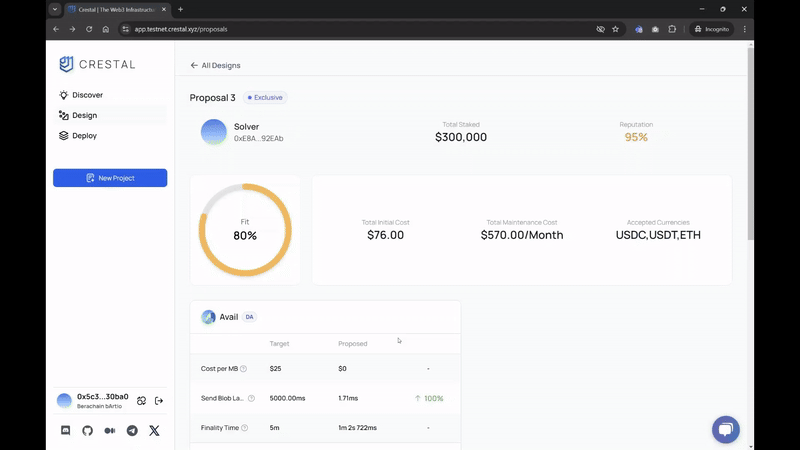

Welcome to Crestal Carbon, our public testnet designed to empower Web3 developers to explore, design, and deploy optimal Web3 infrastructure services. This guide will help you get started with Crestal Carbon and navigate its key features.

## Connect to Crestal Carbon

To begin, visit the [Crestal Carbon Testnet](https://app.testnet.crestal.xyz/) on your laptop browser and connect your EVM-compatible wallet (such as MetaMask) to the platform. You will also need Berachain testnet gas tokens, which can be obtained from the [official faucet](https://bartio.faucet.berachain.com/).

## Explore Crestal Analytics

Crestal Analytics lets you compare performance metrics from various infrastructure providers, including Avail, Celestia, and EigenDA. Use the [Crestal Analytics Dashboard](https://app.testnet.crestal.xyz/dashboard) to explore metrics such as cost per block and time to finality, providing you with a comprehensive view of the data availability landscape. Additional infrastructure categories will be released soon.

## Use Crestal AI Design Assistant

Crestal's AI-powered Design Assistant helps you build decentralized applications by breaking down your project requirements. Note that this feature is only available if you’re building an L2, an Appchain, or require Data Availability.

To start, connect your wallet and visit the [AI assistant page](https://app.testnet.crestal.xyz/assistant). The Design Assistant will guide you through the process of specifying components like execution stacks, DA services, indexers, and oracles. Once complete, your requirements are summarized in a requirement table for submission to the Crestal marketplace.

For example, if you’re building a DEX AppChain, the Design Assistant will guide you through specifying the necessary components, such as execution stacks, data availability (DA) services, indexers, oracles, and more. The AI then summarizes these requirements into a detailed requirement table, which can be submitted to the Crestal marketplace for further deployment proposals.

## Deploy with Crestal Intent-Based Marketplace

After specifying your infrastructure needs, submit them to the [Crestal Intent-Based Marketplace](https://app.testnet.crestal.xyz/designs). Here, expert solvers will propose infrastructure solutions tailored to your requirements. Please note that at this stage, solvers will only include Avail Data Availability in their proposals.

You will receive multiple proposals with information about the technologies used, costs, and solver reputation. Once you choose a proposal, a worker agent will deploy the infrastructure according to the solver’s blueprint.

## Monitor Deployment and Get Node Parameters

During the deployment process, you can track progress in real-time. After setup is complete (usually within a few minutes), you will receive all parameters needed to integrate the deployed infrastructure node into your project. 

## Monitor and Incentivize Performance

Crestal’s **Proof of Performance (PoP™)** mechanism continuously monitors the deployed infrastructure to ensure it meets promised standards. Track these metrics via the [Crestal Deploy Dashboard](https://app.testnet.crestal.xyz/deployments) to ensure your infrastructure is performing as expected.

## Earn Rewards with Quests

Participate in quests to earn Rocks, Crestal Carbon’s testnet points. You can earn rewards by exploring metrics, interacting with the AI, and deploying services. Visit the [Dashboard page](https://app.testnet.crestal.xyz/dashboard) to track your progress, and keep an eye on quests, where new challenges are regularly added. More information about quests and how to complete them can be found [here](./quests).

## Provide Feedback

Your feedback is crucial for improving Crestal. Report bugs, share suggestions, or offer your thoughts via the platform, or connect with us on [Discord](https://discord.com/invite/crestal) or [X](https://x.com/crestalnetwork).
